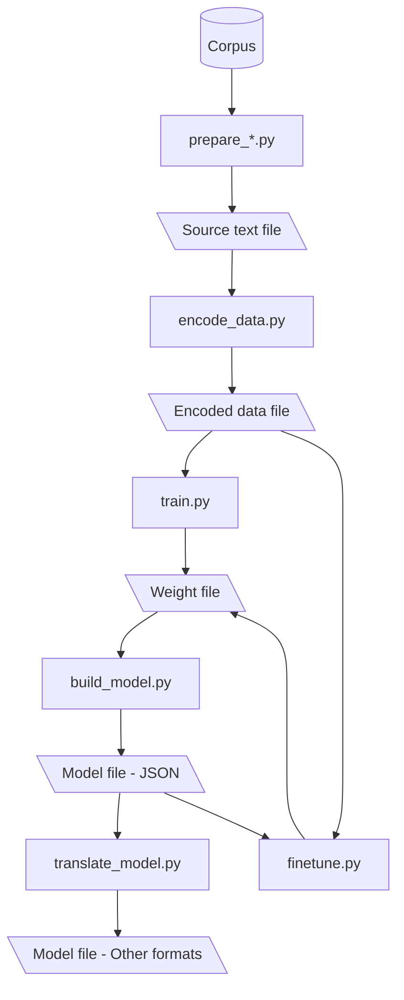

# BudouX scripts

This directory is a collection of scripts to generate BudouX model files.
The figure below provides an overview of how each script transforms data files,
from corpora to machine learning models.



## Preparing a source text

A source text file is a collection of human-readable sentences that have been
annotated with segmentation.
This is the format used to describe a labeled dataset, which is the very first
step in the training pipeline.
Typically, the file content should look like below.
Note that you should use `▁` (U+2581) for segmentation, not underscore.

```text
今日は▁良い▁天気ですね。
明日も▁天気でしょう。
昨日は▁気候が▁良かった。
```

There is no set way to segment sentences.
You can segment sentences however you need to for your specific purpose.
BudouX attempts to learn the rules behind segmentation and provides you with a
machine learning model that segments unseen sentences in the same way.

The default [Japanese model](https://github.com/google/budoux/tree/main/budoux/models/ja.json)
is trained on sentences that have been segmented into [phrases (Bunsetsu)](https://en.wikipedia.org/wiki/Japanese_grammar#Sentences,_phrases_and_words).
The default [Simplified Chinese](https://github.com/google/budoux/tree/main/budoux/models/zh-hans.json)
and [Traditional Chinese](https://github.com/google/budoux/tree/main/budoux/models/zh-hant.json)
models are trained on sentences segmented into words.
We picked these segmentations to provide a satisfactory reading experience in
those languages, but you can apply another segmentation method that works best
for your purpose when you build a custom model.

You can make a source data file by hand or running data preparation scripts (`prepare_*.py`)
that extracts segmented sentences from a corpus.
Currently, this directory has one data preparation script, [`prepare_knbc.py`](https://github.com/google/budoux/tree/main/scripts/prepare_knbc.py),
which generates a source text file from [Kyoto University and NTT Blog (KNBC) Corpus](https://nlp.ist.i.kyoto-u.ac.jp/kuntt/),
which segments Japanese sentences by phrase.
When we support other corpora as data sources, we should add the data
preparation scripts for them in this directory with the `prepare_` prefix.

The below snippet shows how you can prepare a source text file (`source_knbc.txt`)
from the KNBC corpus.

```bash
curl -o knbc.tar.bz2 https://nlp.ist.i.kyoto-u.ac.jp/kuntt/KNBC_v1.0_090925_utf8.tar.bz2
tar -xf knbc.tar.bz2  # outputs KNBC_v1.0_090925_utf8 directory
python scripts/prepare_knbc.py KNBC_v1.0_090925_utf8 -o source_knbc.txt
```

## Encoding a dataset

The next step is to encode a source text file into a format that can be used for
binary classification.
BudouX segments a sentence by analyzing each character to determine if it should
be the end of a segment or connected to the next character.
Hence, each character in a sentence becomes a data point for the binary
classification model, where a positive example indicates that the character is
the end of a segment and a negative example indicates that the character should
be connected to the next.

The encoding process should also extract *features* from the inputs.
A feature is a generated data from the input, which becomes a good signal for a
machine learning algorithm to make useful inferences based on.
BudouX's machine learning model's goal is to predict if the character is
positive or negative from the features generated from.

The encoding script [`encode_data.py`](https://github.com/google/budoux/tree/main/scripts/encode_data.py)
does this job by outputting an encoded data file from a source text file.
You can output an encoded data file named `encoded.txt` from a source file named
`source.txt` by running:

```bash
python scripts/encode_data.py source.txt -o encoded.txt
```

Currently, this script extracts the following types of features looking at the
surrounding 6 characters around the character of interest.
Let's say we're looking at the `i`-th character in a `sentence` and determining
if it's positive (i.e. the end of a segment) or negative (i.e. not the end of a
segment).
The encoding script extracts the features below to make an inference.

- UW1: `sentence.slice(i-2, 1)`
- UW2: `sentence.slice(i-1, 1)`
- UW3: `sentence.slice(i, 1)`
- UW4: `sentence.slice(i+1, 1)`
- UW5: `sentence.slice(i+2, 1)`
- UW6: `sentence.slice(i+3, 1)`
- BW1: `sentence.slice(i-1, 2)`
- BW2: `sentence.slice(i, 2)`
- BW3: `sentence.slice(i+1, 2)`
- TW1: `sentence.slice(i-2, 3)`
- TW2: `sentence.slice(i-1, 3)`
- TW3: `sentence.slice(i, 3)`
- TW4: `sentence.slice(i+1, 3)`

In other words, they are [$n$-grams](https://en.wikipedia.org/wiki/N-gram)
(unigrams, bigrams, and trigrams specifically) around the character of interest.
This encoding approach is heavily influenced by [TinySegmenter](http://chasen.org/~taku/software/TinySegmenter/),
a lightweight Japanese word segmenter.
We could include `sentence.slice(i-2, 2)` and `sentence.slice(i+2, 2)`
technically speaking, but we're not following the convention of the segmenter.

An encoded data file generated by the script is a TSV file that typically looks
like below.
Please note that the snippet shown below is only a portion of the data generated
from the previous example, and is for illustrative purposes only.

```text
-1	UW1:良	UW2:い	UW3:天	UW4:気	UW5:で
-1	UW1:日	UW2:も	UW3:天	UW4:気	UW5:で
1	UW1:昨	UW2:日	UW3:は	UW4:気	UW5:候
```

Each line in the file represents a single data point. The first column of each
line should be either 1 or -1, which indicates whether the data point is a
positive example or a negative example. This is the target output $y$ that the
machine learning model must eventually predict. Each line may have an arbitrary
number of following items. These following items represent the features, which
become the input $\mathbb{x}$ for the machine learning model.

Let's see the mathematical notation for an input $\mathbb{x}$ and an output $y$
that derives from this file.
If we look at the example output above, there are 11 unique features in the
second column and beyond.

1. UW1:日
1. UW1:昨
1. UW1:良
1. UW2:い
1. UW2:も
1. UW2:日
1. UW3:は
1. UW3:天
1. UW4:気
1. UW5:で
1. UW5:候

This means that each input can be represented as a 11-dimensional vector of
features i.e. $\mathbb{x} = (x_1, \cdots, x_{11}) \in \{-1, +1\}^{11}$, where
each value becomes $+1$ if the corresponding feature is present in the line or
$-1$ otherwise.
Following this rule, the snippet above can be read as a list of inputs
$\mathbb{x}$ and outputs $y$ as follows:

| $y$  | $(x_1, x_2, x_3, x_4, x_5, x_6, x_7, x_8, x_9, x_{10}, x_{11})$ |
|------|------------------------------------------------|
| $-1$ | $(-1, -1, +1, +1, -1, -1, -1, +1, +1, +1, -1)$ |
| $-1$ | $(+1, -1, -1, -1, +1, -1, -1, +1, +1, +1, -1)$ |
| $+1$ | $(-1, +1, -1, -1, -1, +1, +1, -1, +1, -1, +1)$ |

The goal of our model training is to design a good function $f$ that predicts
the output from the input, i.e. $y = f(\mathbb{x})$ with generalization ability.

We're intentionally keeping the extracted features as simple as possible to make
the entire library language-neutral and easy to port to other programming
environments.
That being said, you can build a custom parser that is strongly optimized for
your specific needs by adding custom features if you have a good insight around
what type of feature would be beneficial.
Historically, we used to employ features that look to specific [Unicode blocks](https://en.wikipedia.org/wiki/Unicode_block),
but we removed them to make the parsing logic simpler and faster to execute
after we found that their contribution is not significant at <https://github.com/google/budoux/pull/86>.

## Training a model

You can train a BudouX model by passing your encoded data file to [`train.py`](https://github.com/google/budoux/tree/main/scripts/train.py),
and it outputs a weight file, a raw representation of the trained model.

```bash
python scripts/train.py encoded.txt -o weights.txt
```

The encoded data file passed to the positional argument is used as a *training*
dataset, which the training script uses to learn the best parameters for the
model to minimize the error in a greedy manner.
You can also pass another encoded data file as a *validation* dataset with the
optional `--val-data` arg, which is strongly recommended to avoid the machine
learning from overfitting to the training data.
The script reports the metrics over the training and validation data on console
and outputs the trace of them to a log file, which you can specify with the
optional `--log` arg.
You can use these metrics to evaluate if the model is underfitting or
overfitting during the training.

The machine learning algorithm employed behind is [AdaBoost](https://en.wikipedia.org/wiki/AdaBoost),
which calculates how much each feature contributes to the end of a segment.
Each contribution is reprensented by a score, which can be a positive or
negative value; a positive value means positive contribution, while a negative
value means negative contribution.
The longer you run the training (i.e. assigning a larger number of iterations to
the `--iter` arg), the more accurate the output model will be, although it
entails a larger model file size by assigning non-zero contribution scores to
more features.
The contributions scores are the parameters that the machine learning algorithm
can tune, and they are what we call *weights*.

A good nature of this algorithm is that it iteratively updates the weights from
the most important features to the least ones.
The training script appends the weight diffs to the output file, which is
specified by the `--out` arg, at a frequency specified by the `--out-span` arg.
Hence, you can build a model file from the output weight file even if you needed
to interrupt the program before it ends (cf. [Anytime algorithm](https://en.wikipedia.org/wiki/Anytime_algorithm)).

A weight file is a TSV file that saves weight *diffs* as a result of training.
The file content looks like below typically.
This is only showing a part of the weight file generated by the example encoded
data above for illustrative purposes.

```text
UW2:日	1.68
UW1:日	-0.76
UW2:日	0.86
UW3:天	-0.73
UW2:日	0.77
UW1:良	-0.68
```

Please note that the same feature may appear more than once, like the `UW2:日`
in the example above.
It's because they're score diffs the program outputs iteratively throughout the
training process.
The values need to be aggregated by features to get the final weight scores.

Let's see how the weights work in BudouX.
The learned weights should be represented as a weight vector $\mathbb{w}$, which
should have the same length as the input vector (i.e. the number of features).
If we take the example weight file above, the vector should be represented as:

$
\mathbb{w} = (-0.76, 0, 0, 0, 0, (1.68 + 0.86 + 0.77), 0, -0.73, 0, 0, 0) = (
    -0.76, 0, 0, 0, 0, 3.31, 0, -0.73, 0, 0, 0)
$

Please note that the weight scores corresponding to the features that don't
appear in the weight file become zero.
Also, as shown in the 6th element in the vector, the values should be summed up
if the same feature appears multiple times in the weight file.

BudouX uses a weight vector for prediction by taking the dot product between the
input vector and the weight vector.
If the dot product's sign is positive, the output $y$ becomes $+1$ (positive),
while it becomes $-1$ (negative) otherwise.
In other words, BudouX does the binary classification with the equation below:

$y = \text{sgn}(\mathbb{w}^\top \mathbb{x})$

where $\text{sgn}$ is a sign function that is represented as:

$
\text{sgn}(x) = \left\{
\begin{array}{ll}
+1 & (x > 0) \\
-1 & (\text{otherwise})
\end{array}
\right.
$

Most computations in `train.py` are written in [JAX](https://github.com/google/jax)
to take advantage of just-in-time compilation and computational accelerators
such as GPU and TPU.
Running the training script over a big dataset may take time on CPUs, so we
recommend to run the script in the environment with accelerators such as [Colab](https://colab.research.google.com/).

### Exporting a model file

A model file for BudouX is a JSON file that saves aggregated weight scores
grouped by their feature types.
Below shows an example model generated from the example weight file presented above.

```json
{
    "UW1":{
        "日":-760,
        "良":-680
    },
    "UW2":{
        "日":3310
    },
    "UW3":{
        "天":-730
    }
}
```

Notice that the features are separated between the colon mark, and the latters
are grouped by the former.
The scores are summed up if there are multiple items that belong to the same group.
Also, the scores are scaled and round to integers.
We apply these conversations to make the output model file smaller and the
inference faster.

The keys in the first layer (e.g. `UW1` and `UW2`) are the feature types that
represent how the corresponding features are extracted from the source data, as
covered by the data encoding section in detail.
The keys in the second layer (e.g. `日` and `天`) are the corresponding feature
values.

You can generate a model file by simply passing the weight file to [`build_model.py`](https://github.com/google/budoux/tree/main/scripts/build_model.py).

```bash
python scripts/build_model.py weights.txt -o model.json
```

### Translating a model

JSON is the primary format for the BudouX models, but some libraries (e.g. [ICU](https://icu.unicode.org/))
may want to use another serialization format to store  model data.
You can translate a model JSON file to another format with [`translate.py`](https://github.com/google/budoux/tree/main/scripts/translate.py)
if it's more useful for your specific purpose.
For example, you can convert a model file to an ICU Resource Bundle by running:

```bash
python scripts/translate_model.py model.json --format=icu > icu_bundle.txt
```

This script is where to add code when we need to support other formats.

## Fine-tuning a model

If a model file does not work with some specific cases, you can fine-tune the
model using [`finetune.py`](https://github.com/google/budoux/tree/main/scripts/finetune.py).
The fine-tuning script takes a base model JSON file (`base_model.json`) and an additional
encoded data file (`another_encodewd.txt`) as inputs, and outputs an updated
weight file (`new_weights.txt`).

```bash
python scripts/finetune.py another_encoded.txt base_model.json -o new_weights.txt
```

The additional encoded data should cover specific cases that the base model
file does not handle well. The script updates the weight scores saved in the
base model to minimize the error over the additional encoded data, and outputs
the updated weight scores to a weight file.

Here's an overview of the algorithm behind the fine-tuning script.
As mentioned earlier, BudouX is essentially a binary classification model
represented as $y = \text{sgn}(\mathbb{w}^\top \mathbb{x})$ where $\mathbb{x}$
is an input vector, $\mathbb{w}$ is a weight vector, and $\text{sgn}$ is a sign
function.

To make this model differentiable, we approximate the sign function with a
sigmoid function, which represent the model as:

$y = \text{sigmoid}(\mathbb{w}^\top \mathbb{x}), \ \text{sigmoid}(x) = (1 + \exp(-x))^{-1}$

Then we can define a cross entropy loss over the model, where $t$ represents the
actual output.

$L(t, y) = -t \log y -(1 - t) \log(1 - y)$

The fine-tuning script updates the weight $\mathbb{w}$ to minimize the mean cross
entropy loss with gradient descent with a learning rate of $\alpha > 0$ (the
`--learning-rate` arg):

$\mathbb{w} \leftarrow \mathbb{w} - \alpha \frac{d}{dw}\{
    \frac{1}{N}\sum_{t_n, \mathbb{x}_n \in D} L(
        t_n, \text{sigmoid}(\mathbb{w}^\top \mathbb{x}_n))\}$

where:

- $D$ denotes a training dataset
- $N$ denotes the number of examples included in $D$
- $\mathbb{x}_n$ denotes the input of the $n$-th example.
- $t_n$ denotes the target output of the $n$-th example.

Please note that the weight vector reconstructed from the base model file doesn't
necessarily have the same shape as the one used in generating the base model initially.
Practically, the reconstructed weight vector is expected to have a much smaller
number of dimensions because the initial training process should have assigned a
weight of zero to most of the features, and such features have been filtered out
in the exporting process.
The fine-tuning script only updates the existing weights in the base model, and
does not add new features even if there were new features extracted from the
additional encoded data.
Therefore, the output model should have almost the same file size as the base model.

The source text files for fine-tuning should be recorded in the [`data/finetuning`](https://github.com/google/budoux/tree/main/data/finetuning)
directory.
For example, we can fine-tine a Japanese model with the base model trained on
the KNBC corpus [`budoux/models/ja_knbc.json`](https://github.com/google/budoux/tree/main/budoux/models/ja_knbc.json)
with the following commands.

```bash
python scripts/encode_data.py data/finetuning/ja/train.txt -o encoded_train.txt
python scripts/encode_data.py data/finetuning/ja/val.txt -o encoded_val.txt
python scripts/finetunel.py encoded_train.txt budoux/models/ja_knbc.json --val-data=encoded_val.txt -o new_weights.txt
python scripts/build_model.py new_weights.txt -o budoux/models/ja.json
```
